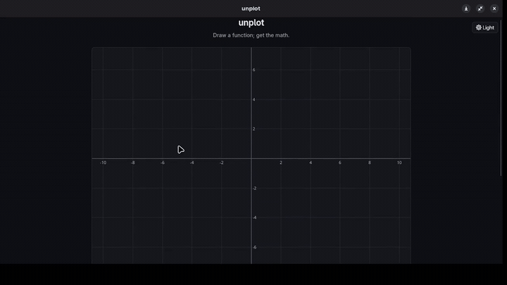

# unplot

**Draw a function. Get the math.**

Desmos plots a formula you type. unplot does the reverse: you _draw_ a smooth
curve `y = f(x)` on a Cartesian plane, and it hands back the exact function — as
clean LaTeX you can differentiate, integrate, edit, and save.

What you get back is exactly what you drew: a shape-preserving spline that is a
valid function by construction, not a guess. And when your drawing really is a
simple function, unplot _also_ proposes a compact closed form — `f(x) ≈ 3x²`,
`cos x`, `1/x` — always shown with its error, never presented as exact.

[](https://github.com/vitorwilson/unplot/blob/main/showcase.mp4)

> ▶ [Watch the full demo](https://github.com/vitorwilson/unplot/blob/main/showcase.mp4) (54s, with sound).

## Features

- **Draw a function, get exact LaTeX.** The stroke becomes a shape-preserving
  PCHIP spline that is a valid function by construction — the pen hard-blocks
  anything that isn't one (no reversing in x, no vertical spikes).
- **Edit everything.** Drag knots and tangent handles, translate the whole curve,
  undo/redo — or type `x, y` points directly and plot them.
- **Calculus, exactly.** Differentiate and integrate the curve. When it's a
  recognized function the result is exact and symbolic — d/dx of a drawn x³ is
  3x², not a lumpy numeric approximation.
- **A "prettier function."** An error-gated closed-form guess — polynomials,
  waves of any frequency, and pole-shaped rationals — shown _beside_ the exact
  output with its max/RMS error, never in place of it.
- **Copy anywhere.** Export the function as LaTeX, Desmos, or Wolfram.
- **Save & reopen.** A versioned, cross-platform `.unplot` document stores just
  the points, so a saved curve reopens fully editable.
- **Cross-platform, offline, light/dark.** Windows, macOS, and Linux. No network
  access, ever.

## Install

Download the installer for your platform from the
[latest release](https://github.com/vitorwilson/unplot/releases/latest):

- **Windows** — `.msi` or `.exe`
- **macOS** — `.dmg` (universal: Apple Silicon + Intel)
- **Linux** — `.AppImage`, `.deb`, or `.rpm`

The builds aren't code-signed yet, so your OS will warn about an unidentified
developer the first time you open the app. To get past it:

- **macOS** — right-click the app and choose **Open**, then **Open** again (only
  needed once). If it still refuses, clear the quarantine flag:
  `xattr -dr com.apple.quarantine /Applications/unplot.app`.
- **Windows** — on the SmartScreen prompt, click **More info → Run anyway**.

## Run from source

Needs [Rust](https://rustup.rs), [Node](https://nodejs.org) 22+,
[pnpm](https://pnpm.io), and [`just`](https://github.com/casey/just). On Linux
you also need the [Tauri prerequisites](https://tauri.app/start/prerequisites/)
(WebKitGTK etc.).

```sh
pnpm install     # frontend dependencies
just dev         # run the desktop app (Vite + Tauri)
just test        # full test suite: Rust core + frontend
```

## How it works

A **headless Rust core** (`crates/curve-engine/`) does the math — spline fitting,
analytic calculus, the closed-form approximator, the symbolic layer, and file
I/O — and never imports the UI, so it is fully unit-tested on its own. A **Canvas
2D + TypeScript frontend** (`src/`) handles drawing, editing, and the KaTeX math
panel. **Tauri** (`src-tauri/`) glues them into a desktop app. The design
decisions and roadmap live in [`docs/PLAN.md`](docs/PLAN.md).

## Contributing

Contributions are welcome — see [CONTRIBUTING.md](CONTRIBUTING.md) for setup, the
architecture, and the conventions, and please follow the
[Code of Conduct](CODE_OF_CONDUCT.md). Report bugs or request features through the
[issue tracker](https://github.com/vitorwilson/unplot/issues/new/choose); for
security problems, see [SECURITY.md](SECURITY.md).

## License

[MIT](LICENSE) © Vitor Wilson
